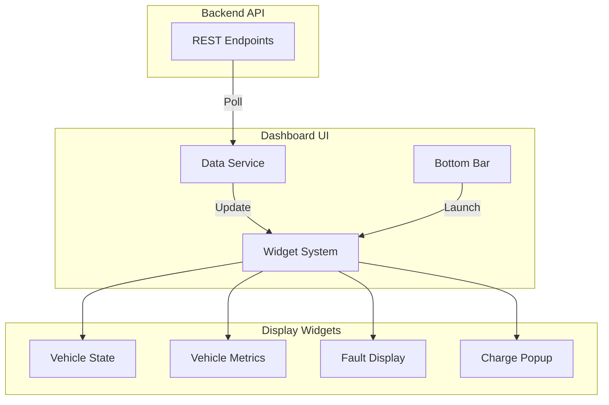

# Infotainment Dashboard
PyQt6-based graphical interface for displaying vehicle information and controls.

## Overview
This application provides a modern, touch-friendly dashboard interface for vehicle information. It displays vehicle state, metrics, and fault information in real-time, with support for multiple widget layouts and a charging state popup.

## System Architecture


## Features
- Dynamic widget system
- Real-time data updates
- Touch-friendly interface
- State-aware display
- Charging status popup
- Fault monitoring display

## Widget Layout System
- Empty: Single widget fills screen
- Two Widgets: Split screen horizontally
- Three Widgets: Split into thirds
- Drag from bottom bar to add
- Drag from top 15% to remove
- Drag to reposition

## Project Structure
```
infotainment_dashboard/
├── app/
│   ├── components/
│   │   ├── charging_popup.py
│   │   ├── draggable_button.py
│   │   ├── draggable_widget.py
│   │   ├── drop_area.py
│   │   ├── fault_widget.py
│   │   ├── state_widget.py
│   │   └── vehicle_widget.py
│   ├── services/
│   │   └── data_service.py
│   ├── utils/
│   │   ├── constants.py
│   │   └── image_utils.py
│   └── windows/
│       └── main_dashboard.py
├── assets/
│   └── modern_sports_car_offcenter_right.jpg
└── main.py
```

## Prerequisites
- Python 3.11+
- PyQt6
- Required packages:
  - PyQt6
  - requests
  - pillow

## Setup
1. Create virtual environment:
```bash
python -m venv .venv
source .venv/bin/activate
```

2. Install dependencies:
```bash
pip install -r requirements.txt
```

## Running the Dashboard
1. Start the application:
```bash
python main.py
```

## Usage Guide

### Bottom Bar Apps
- Navigation
- Music
- Climate
- Phone
- Vehicle Info
- Settings
- Charging (appears in charge state)

### Widget Management
1. Drag app from bottom bar to display
2. Drag from widget header to reposition
3. Drag down from header to remove
4. Maximum of three widgets

### Charging Mode
- Popup appears automatically
- Can be minimized/restored
- Shows charge status and metrics
- Available via bottom bar icon

## Development Notes
- Uses QT6 for modern UI components
- Polls backend API for updates
- Handles connection status
- Manages widget lifecycle
- Provides touch-friendly interactions

## Styling
- Background blur when widgets present
- Semi-transparent widgets
- Color-coded status indicators
- Modern automotive aesthetic
