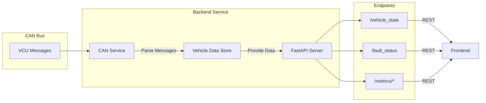

# Infotainment Backend
API service that converts CAN bus messages from VCU into HTTP endpoints for the infotainment dashboard.

## Overview
This backend service listens for CAN messages from the VCU, processes and stores the vehicle data, and provides REST API endpoints for the infotainment dashboard. It acts as a bridge between the vehicle's CAN network and the user interface.

## System Architecture


## Features
- Real-time CAN message monitoring
- Message parsing and state tracking
- REST API endpoints
- Fault status monitoring
- Vehicle metrics processing
- Connection status monitoring

## API Endpoints

### Main Endpoints
| Endpoint | Method | Description | Update Rate |
|----------|--------|-------------|-------------|
| /vehicle_data | GET | All vehicle data | 200ms |
| /vehicle_state | GET | Current vehicle state | 100ms |
| /fault_status | GET | Active faults | 100ms |

### Metric Endpoints
| Endpoint | Description |
|----------|-------------|
| /metrics/powertrain | Battery, motor, power data |
| /metrics/tires | Tire temperature and pressure |

## Project Structure
```
infotainment_backend/
├── app/
│   ├── api/
│   │   └── endpoints.py    # API route definitions
│   ├── core/
│   │   └── constants.py    # Configuration and constants
│   ├── models/
│   │   └── vehicle_data.py # Data models
│   ├── services/
│   │   └── can_service.py  # CAN message handling
│   └── main.py            # FastAPI application
├── server.py              # Entry point
└── README.md
```

## Prerequisites
- Python 3.11+
- CAN interface configured
- Required packages:
  - fastapi
  - uvicorn
  - python-can
  - pydantic

## Setup
1. Create virtual environment:
```bash
python -m venv .venv
source .venv/bin/activate
```

2. Install dependencies:
```bash
pip install -r requirements.txt
```

3. Configure CAN interface:
```bash
sudo ip link set can0 type can bitrate 500000
sudo ip link set up can0
```

## Running the Service
1. Start the server:
```bash
python server.py
```

2. Check API status:
```bash
curl http://localhost:8000/health
```

## API Examples

### Get Vehicle State
```bash
curl http://localhost:8000/vehicle_state
```
Response:
```json
{
    "primary_state": "PARK",
    "sub_state": "READY",
    "status_flags": ["BATTERY_OK", "SYSTEMS_CHECK_PASS"],
    "fault_present": false,
    "message_counter": 1234
}
```

### Get Fault Status
```bash
curl http://localhost:8000/fault_status
```
Response:
```json
{
    "active": false,
    "source": null,
    "type": null,
    "severity": 0,
    "timestamp": 0,
    "counter": 0
}
```

## Development Notes
- Backend runs on port 8000 by default
- Monitors CAN messages in real-time
- Updates vehicle data store on message receipt
- Provides data to frontend via REST endpoints
- Handles connection status and error monitoring
